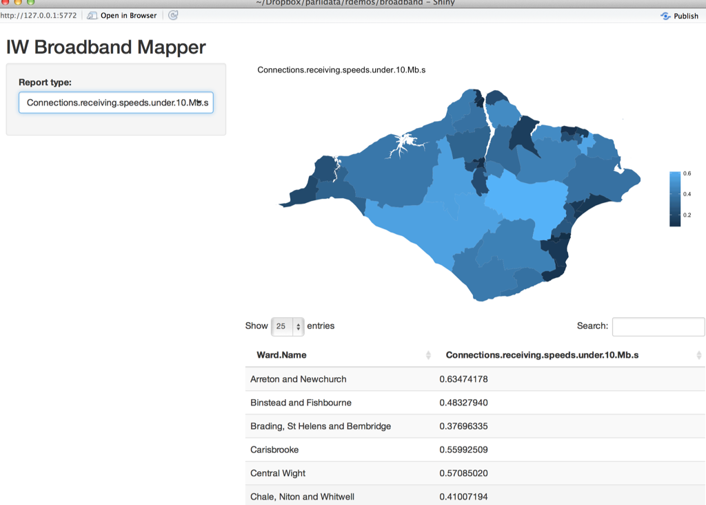

# parlihacks
Repository for doodles around Parliamentary Data, matter of possible interest to PDS, Parliamentary Library, et al.

Original repo (source code for reports listed below): [here](https://github.com/psychemedia/parlihacks).

Work prepared for this repo originally funded by the [Parliamentary Digital Service (PDS)](https://pds.blog.parliament.uk/).

- [HTML output of *GP Practice List by LSOA.ipynb*](https://psychemedia.github.io/parlihacks/GP%2BPractice%2BList%2Bby%2BLSOA.html) [[code](https://github.com/psychemedia/parlihacks/blob/master/notebooks/GP%20Practice%20List%20by%20LSOA.ipynb)]
- [HTML knit of *gplsoa.Rmd*](https://psychemedia.github.io/parlihacks/gplsoa.html) [[code](https://github.com/psychemedia/parlihacks/blob/master/Rmd/gplsoa.Rmd)]
- [PDF knit of *gplsoa.Rmd*](https://psychemedia.github.io/parlihacks/gplsoa.pdf) [[code](https://github.com/psychemedia/parlihacks/blob/master/Rmd/gplsoa.Rmd)]
- [example of parameterised reports for IW GP practices from *gplsoaMultiReport.Rmd* and *gplsoa_base.Rmd*](https://psychemedia.github.io/parlihacks/iwgplsoadocs) [[multireport code](https://github.com/psychemedia/parlihacks/blob/master/Rmd/gplsoaMultiReport.Rmd) and [base code](https://github.com/psychemedia/parlihacks/blob/master/Rmd/gplsoa_base.Rmd)]
- Broadband maps - [PDF knit of *bbWard_base.Rmd*](https://psychemedia.github.io/parlihacks/bbWard_base.pdf) [[code](https://github.com/psychemedia/parlihacks/blob/master/Rmd/bbWard_base.Rmd)]
- Broadband map shiny app [[code](https://github.com/psychemedia/parlihacks/tree/master/shinyapps/broadband)] 

- Sankey diagram demo (Rmd) - [HTML output of Rmd](https://psychemedia.github.io/parlihacks/sankeyFlow.html), [Rmd code](https://github.com/psychemedia/parlihacks/blob/master/Rmd/sankeyFlow.Rmd)
- Sankey diagram demo (ipynb) - [HTML output of ipynb](https://psychemedia.github.io/parlihacks/MigrantFlow.html), [ipynb notebook](https://github.com/psychemedia/parlihacks/blob/master/notebooks/MigrantFlow.ipynb)
- Sankey demo2 - written questions: [notebook](https://github.com/psychemedia/parlihacks/blob/master/notebooks/WrittenQuestions.ipynb) and [HTML output](https://psychemedia.github.io/parlihacks/WrittenQuestions.html)

## Related blog posts:

- [Reporting in a Repeatable, Parameterised, Transparent Way](https://blog.ouseful.info/2017/02/23/reporting-in-a-repeatable-parameterised-transparent-way/)
- [Reuse and Build On – IW Broadband Reports](https://blog.ouseful.info/2017/03/09/reuse-and-build-on-iw-broadband-reports/)
- [Transparency in Parliament… And in Data Journalism?](https://blog.ouseful.info/2017/03/15/transparency-in-parliament-and-in-data-journalism/)
- [Experimenting With Sankey Diagrams in R and Python](https://blog.ouseful.info/2017/03/17/experimenting-with-sankey-diagrams-in-r-and-python/)
- [Tinkering With Parliament Data APIs: Commons Written Questions And Parliamentary Written Answers
](https://blog.ouseful.info/2017/03/18/tinkering-with-parliament-data-apis-commons-written-questions-and-parliamentary-written-answers/)
